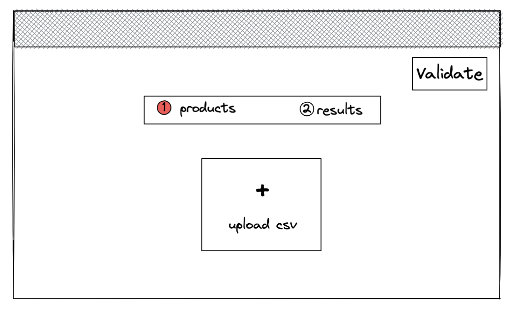
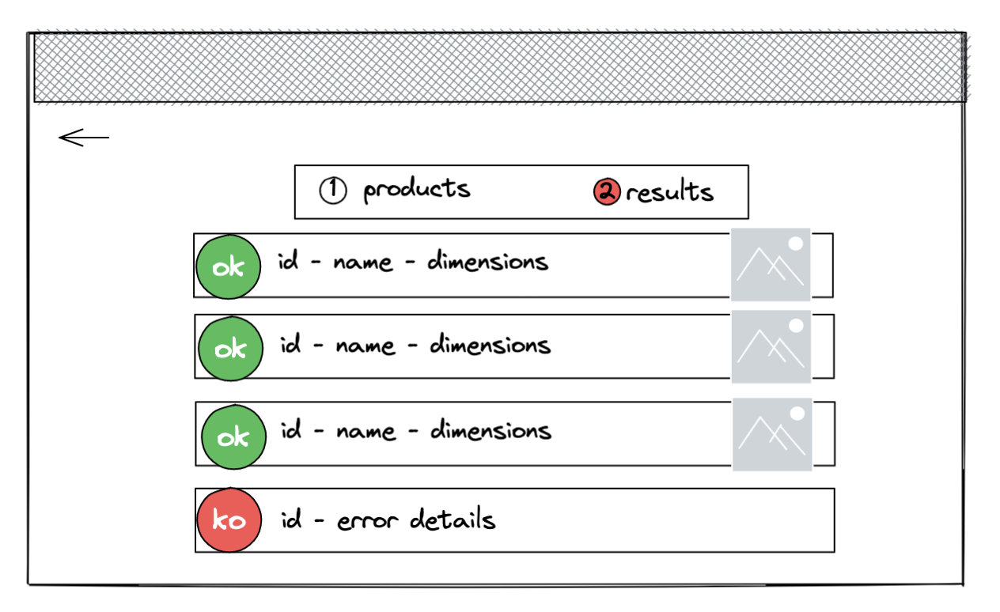

# Technical test

## Infos

- You must do your best to complete the test in **2 hours**.
- You must use **git** as version control system and publish your code in a **public github or gitlab repo** (and give us the link of the repository)
- You can add all packages and libraries you need to implement this technical test
- You can add all the development tools you want to improve your developer experience
- All provided mockup and images are only **sources of inspiration**
- You will **not** be evaluated for the UX and UI of the application but a nice design is always welcome

## Introduction

The application we want to develop consists of allowing the user to import it's catalog of products.

We provide a project skeleton which contains:

- A `server` folder that contains the default server code: a simple express server
- A `client` folder that contains the default client code: a simple create-react-app application
- An `assets` folder that contains a sample of products (`import.csv`)

The frontend application is a single page with a multi steps module:

1. **Step 1** - import the products



2. **Step 2** - display the imported product



## Exercise
### Frontend

Create a page which allows the users to upload a csv file containing product information ([see csv specification](#csv-specification)) and validate to show the response. This page will call a /upload endpoint that you will develop on purpose.

The response is shown in a new page and it shows for each imported product: it's status (imported correctly or not). If imported correctly display the product name, the picture's dimensions and a picture, otherwise, display the error details.
### Backend

Create an endpoint: `POST /upload` which accepts a POST request with `multipart/form-data` header containing a `.csv` file.
Parse the csv file and return a JSON response which contains for each row (except header row)

- id: String
- name: String
- picture: Object
  - url: String
  - width: Number
  - height: Number

Picture width and height are not given in the csv so you have to compute its dimensions on your own.

Response example:

```
{ 
  data: [
    {
      id: "5f97fdce664d456a5a16e980",
      name: "my product 1",
      picture: {
        url:  "https://res.cloudinary.com/hubstairs/image/upload/v1620083358/production/5e2414ef.png",
        width: 640,
        height: 480
      }
    }
  ]
}
```

The order of the elements in this array does not need to be the same as in the CSV file.

You should handle errors and return a response with both imported data and errors encountred.

Response example:
```
{
  data: [],
  errors: [], // encountred errors
}
```

## CSV specification

The csv file always contains a header row: `id;name;url`

Then for each row it contains:

- an id: hexadecimal string; required
- a name: max length 300 characters; required
- a picture url: url; required
